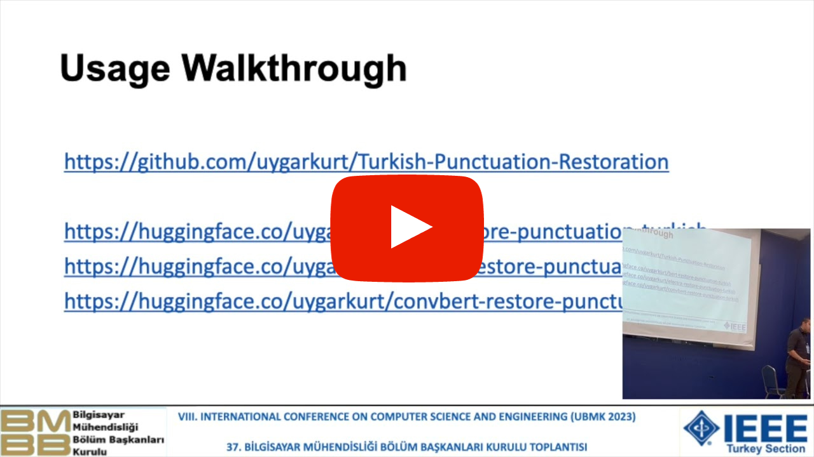

# Transformer Based Punctuation Restoration Models for Turkish

<div align="center">
    <a href="https://ieeexplore.ieee.org/document/10286690">
        
    </a>
    <a href="https://en.wikipedia.org/wiki/Open_source">
        
    </a>
</div>
<br/>
<div align="center">
    <p>Liked our work? give us a ⭐!</p>
</div>

This repository contains the official implementation of the paper [Transformer Based Punctuation Restoration for Turkish](https://ieeexplore.ieee.org/document/10286690). This paper got accepted from UBMK23. Aim of this work is correctly place pre-decided punctuation marks in a given text.  We present three pre-trained transformer models to predict **period(.)**, **comma(,)** and **question(?)** marks for the Turkish language.

### YouTube Presentation
This paper also contains a corresponding presentation published on YouTube with the title **Transformer Based Punctuation Restoration for Turkish - Paper Presentation**

[](https://www.youtube.com/watch?v=PGAEamxP2Cw)


## Table of Contents
* [Usage](#usage)
    * [Inference](#inference)
    * [Training](#train)
* [Data](#data)
* [Available Models](#models)
* [Results](#results)
* [Contact](#contact)

## Usage <a class="anchor" id="usage"></a>

### Inference <a class="anchor" id="inference"></a>
Recommended usage is via HuggingFace. You can run an inference using the pre-trained BERT model with the following code:
``` 
from transformers import pipeline

pipe = pipeline(task="token-classification", model="uygarkurt/bert-restore-punctuation-turkish")

sample_text = "Türkiye toprakları üzerindeki ilk yerleşmeler Yontma Taş Devri'nde başlar Doğu Trakya'da Traklar olmak üzere Hititler Frigler Lidyalılar ve Dor istilası sonucu Yunanistan'dan kaçan Akalar tarafından kurulan İyon medeniyeti gibi çeşitli eski Anadolu medeniyetlerinin ardından Makedonya kralı Büyük İskender'in egemenliğiyle ve fetihleriyle birlikte Helenistik Dönem başladı"

out = pipe(sample_text)
```

To use a different pre-trained model you can just replace the `model` argument with one of the other [available models](#models) we provided.

### Training <a class="anchor" id="train"></a>
For training you will need `transformers`, `datasets`. You can install the versions we used with the following commands: `pip3 install transformers==4.25.1`

To train a model run `python main.py`. This will train the BERT model by default on given dataset on the path specified by the `train_path`, `val_path` and `test_path` variables located at the `main.py`.

Trained model will be saved under `./model_save` directory.

If you want to train with a model other then BERT change the arguments of `.from_pretrained()` accordingly.

## Data <a class="anchor" id="data"></a>
Dataset is provided in `data/` directory as train, validation and test splits.

Dataset can be summarized as below:

|    Split    |  Total  | Period (.) | Comma (,) | Question (?) |
|:-----------:|:-------:|:----------:|:---------:|:------------:|
|    Train    | 1471806 |   124817   |   98194   |     9816     |
| Validation  |  180326 |    15306   |   11980   |     1199     |
|   Test      |  182487 |    15524   |   12242   |     1255     |

## Available Models <a class="anchor" id="models"></a>
We experimented with BERT, ELECTRA and ConvBERT. Pre-trained models can be accessed via Huggingface.

BERT: https://huggingface.co/uygarkurt/bert-restore-punctuation-turkish \
ELECTRA: https://huggingface.co/uygarkurt/electra-restore-punctuation-turkish \
ConvBERT: https://huggingface.co/uygarkurt/convbert-restore-punctuation-turkish

## Results <a class="results" id="results"></a>
`Precision` and `Recall` and `F1` scores for each model and punctuation mark are summarized below.

|   Model  |          |  PERIOD  |          |          |  COMMA   |          |          | QUESTION |          |          | OVERALL  |          |
|:--------:|:--------:|:--------:|:--------:|:--------:|:--------:|:--------:|:--------:|:--------:|:--------:|:--------:|:--------:|:--------:|
|Score Type|     P    |     R    |    F1    |     P    |     R    |    F1    |     P    |     R    |    F1    |     P    |     R    |    F1    |
|   BERT   | 0.972602 | 0.947504 | 0.959952 | 0.576145 | 0.700010 | 0.632066 | 0.927642 | 0.911342 | 0.919420 | 0.825506 | 0.852952 | 0.837146 |
|  ELECTRA | 0.972602 | 0.948689 | 0.960497 | 0.576800 | 0.710208 | 0.636590 | 0.920325 | 0.921074 | 0.920699 | 0.823242 | 0.859990 | 0.839262 |
| ConvBERT | 0.972731 | 0.946791 | 0.959585 | 0.576964 | 0.708124 | 0.635851 | 0.922764 | 0.913849 | 0.918285 | 0.824153 | 0.856254 | 0.837907 |

## Contact <a class="contact" id="contact"></a>
You can contact me with this email address: uygarsci@gmail.com
